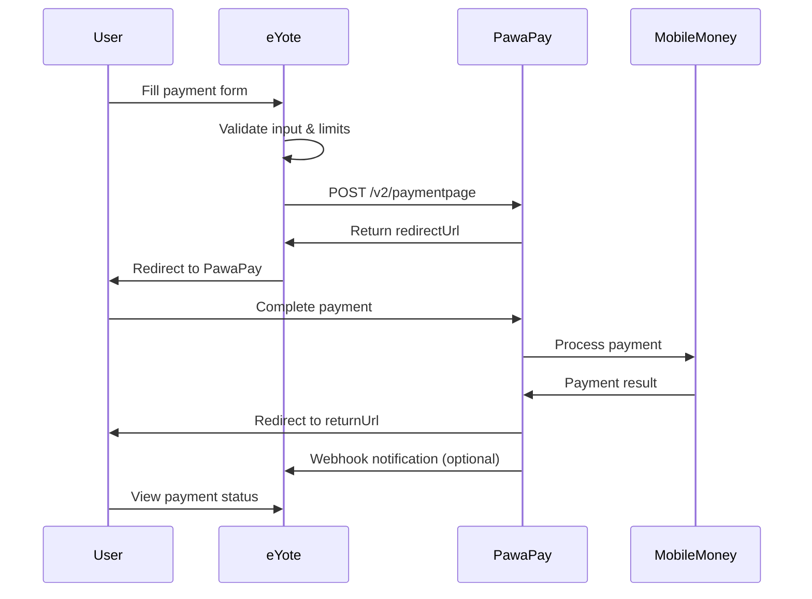

# PawaPay Payment Page Integration - Comprehensive Guide

## 🏗️ **Architecture Overview**

### **Integration Pattern Analysis**
The PawaPay v2 Payment Page follows a **redirect-based payment flow** that provides:
- **Security**: No sensitive payment data handled by merchant
- **Compliance**: PCI-DSS compliant payment processing
- **UX**: Seamless redirect experience with branded payment pages
- **Reliability**: Built-in retry mechanisms and error handling

### **Core Flow Implementation**


## 🔧 **Implementation Best Practices**

### **1. Payment Validation Strategy**

#### **Client-Side Validation (Real-time UX)**
```typescript
// Real-time validation as user types
const validateAmount = (amount: number, country: string, currency: string) => {
  const limits = PaymentConfigService.getPaymentLimits(country, currency);
  if (!limits) return { isValid: false, error: 'Country not supported' };
  
  if (amount < limits.minAmount) {
    return { 
      isValid: false, 
      error: `Minimum: ${formatAmount(limits.minAmount, currency)}` 
    };
  }
  
  if (amount > limits.maxAmount) {
    return { 
      isValid: false, 
      error: `Maximum: ${formatAmount(limits.maxAmount, currency)}` 
    };
  }
  
  return { isValid: true };
};
```

#### **Server-Side Validation (Security)**
```typescript
// Always validate on server before API calls
const validatePaymentRequest = (data: PaymentFormData) => {
  // Amount validation
  const amountValidation = PaymentConfigService.validateAmount(
    data.amount, data.country, data.currency
  );
  
  // Phone validation with country-specific patterns
  const phoneValidation = EnhancedPawaPayService.validatePhoneNumber(
    data.phoneNumber, data.country
  );
  
  // Description validation (PawaPay limits: 4-22 chars)
  const descriptionValid = data.description.length >= 4 && 
                          data.description.length <= 22;
  
  return {
    isValid: amountValidation.isValid && phoneValidation.isValid && descriptionValid,
    errors: { /* collect all errors */ }
  };
};
```

### **2. Error Handling Strategy**

#### **Categorized Error Handling**
```typescript
interface PawaPayError {
  code: string;
  message: string;
  retryable: boolean;
  statusCode?: number;
  userAction?: 'retry' | 'contact_support' | 'check_details';
}

// Error categorization for better UX
const categorizeError = (error: PawaPayError) => {
  const retryableErrors = [
    'PROVIDER_TEMPORARILY_UNAVAILABLE',
    'SYSTEM_TEMPORARILY_UNAVAILABLE',
    'RATE_LIMIT_EXCEEDED',
    'TIMEOUT',
    'NETWORK_ERROR'
  ];
  
  const userErrors = [
    'INVALID_PHONE_NUMBER',
    'AMOUNT_VALIDATION_FAILED',
    'INSUFFICIENT_FUNDS'
  ];
  
  if (retryableErrors.includes(error.code)) {
    return { ...error, userAction: 'retry' as const };
  }
  
  if (userErrors.includes(error.code)) {
    return { ...error, userAction: 'check_details' as const };
  }
  
  return { ...error, userAction: 'contact_support' as const };
};
```

#### **Retry Logic with Exponential Backoff**
```typescript
const makeRequestWithRetry = async <T>(
  requestFn: () => Promise<T>,
  maxRetries: number = 3
): Promise<T> => {
  for (let attempt = 0; attempt <= maxRetries; attempt++) {
    try {
      return await requestFn();
    } catch (error) {
      // Don't retry client errors (4xx)
      if (isClientError(error)) throw error;
      
      // Don't retry on last attempt
      if (attempt === maxRetries) throw error;
      
      // Exponential backoff: 1s, 2s, 4s
      const delay = 1000 * Math.pow(2, attempt);
      await new Promise(resolve => setTimeout(resolve, delay));
    }
  }
};
```

### **3. Session Management & Security**

#### **Secure Session Tracking**
```typescript
// Generate secure session IDs
const createPaymentSession = (depositId: string) => {
  const session: PaymentSession = {
    depositId,
    sessionId: crypto.randomUUID(),
    status: 'CREATED',
    createdAt: new Date(),
    expiresAt: new Date(Date.now() + 30 * 60 * 1000), // 30 min
    metadata: {
      userAgent: request.headers.get('user-agent'),
      ipAddress: getClientIP(request),
      country: formData.country
    }
  };
  
  // Store in secure session storage (Redis/Database)
  await storeSession(session);
  return session;
};
```

#### **Webhook Security**
```typescript
// Verify webhook signatures
const verifyWebhook = (payload: string, signature: string, secret: string) => {
  const expectedSignature = crypto
    .createHmac('sha256', secret)
    .update(payload)
    .digest('hex');
    
  return crypto.timingSafeEqual(
    Buffer.from(signature),
    Buffer.from(expectedSignature)
  );
};
```

### **4. Payment Variations Implementation**

#### **Flexible Payment (Current Implementation)**
- User selects: country, amount, phone number
- Best for: General payment forms

#### **Fixed Amount Payment**
```typescript
const createFixedAmountPayment = (amount: number, currency: string) => {
  return {
    ...basePaymentRequest,
    amountDetails: { amount: amount.toFixed(2), currency },
    // User only selects country and phone
  };
};
```

#### **Fixed Phone Payment**
```typescript
const createFixedPhonePayment = (phoneNumber: string, country: string) => {
  return {
    ...basePaymentRequest,
    phoneNumber,
    country,
    // User only selects amount
  };
};
```

#### **Fully Fixed Payment**
```typescript
const createFixedPayment = (
  amount: number, 
  currency: string, 
  phoneNumber: string, 
  country: string
) => {
  return {
    ...basePaymentRequest,
    amountDetails: { amount: amount.toFixed(2), currency },
    phoneNumber,
    country,
    // User just confirms payment
  };
};
```

## 🚀 **Production Deployment Checklist**

### **Environment Configuration**
```bash
# Required Environment Variables
PAWAPAY_BASE_URL=https://api.pawapay.io  # Production URL
PAWAPAY_API_TOKEN=your_production_token
PAWAPAY_WEBHOOK_SECRET=your_webhook_secret
PAWAPAY_CALLBACK_URL=https://yourdomain.com/api/webhooks/pawapay

# Optional Configuration
PAYMENT_SESSION_TIMEOUT=1800  # 30 minutes
MAX_RETRY_ATTEMPTS=3
RATE_LIMIT_REQUESTS=100
RATE_LIMIT_WINDOW=60000  # 1 minute
```

### **Security Hardening**
1. **API Token Security**
   - Store in secure environment variables
   - Rotate tokens regularly
   - Use different tokens for staging/production

2. **Webhook Security**
   - Always verify signatures
   - Use HTTPS endpoints only
   - Implement rate limiting

3. **Input Validation**
   - Validate all inputs server-side
   - Sanitize user data
   - Implement CSRF protection

### **Monitoring & Observability**
```typescript
// Payment metrics to track
const trackPaymentMetrics = {
  paymentInitiated: (country: string, currency: string, amount: number) => {
    metrics.increment('payment.initiated', { country, currency });
    metrics.histogram('payment.amount', amount, { currency });
  },
  
  paymentCompleted: (depositId: string, duration: number) => {
    metrics.increment('payment.completed');
    metrics.histogram('payment.duration', duration);
  },
  
  paymentFailed: (error: PawaPayError) => {
    metrics.increment('payment.failed', { 
      error_code: error.code,
      retryable: error.retryable.toString()
    });
  }
};
```

## 🔍 **Potential Challenges & Solutions**

### **Challenge 1: Network Reliability**
**Problem**: Mobile networks in target countries can be unreliable
**Solution**: 
- Implement robust retry logic
- Show clear loading states
- Provide offline-friendly error messages

### **Challenge 2: User Experience During Redirects**
**Problem**: Users may get confused during redirect flow
**Solution**:
- Clear messaging about redirect
- Loading states during redirect
- Breadcrumb navigation
- Session persistence across redirects

### **Challenge 3: Payment Status Synchronization**
**Problem**: Status updates may be delayed or missed
**Solution**:
- Implement both webhooks AND polling
- Graceful degradation if webhooks fail
- User-friendly status explanations

### **Challenge 4: Currency & Amount Handling**
**Problem**: Different currencies have different decimal places
**Solution**:
```typescript
const formatAmountByCurrency = (amount: number, currency: string) => {
  const decimalPlaces = {
    'UGX': 0,  // Ugandan Shilling - no decimals
    'GHS': 2,  // Ghanaian Cedi - 2 decimals
    'ZMW': 2,  // Zambian Kwacha - 2 decimals
    'KES': 2,  // Kenyan Shilling - 2 decimals
    'TZS': 0,  // Tanzanian Shilling - no decimals
    'RWF': 0   // Rwandan Franc - no decimals
  };
  
  return amount.toFixed(decimalPlaces[currency] || 2);
};
```

## 📊 **Performance Optimization**

### **Frontend Optimizations**
1. **Lazy Loading**: Load payment components only when needed
2. **Caching**: Cache country/currency data
3. **Debouncing**: Debounce validation calls
4. **Preloading**: Preload PawaPay redirect page

### **Backend Optimizations**
1. **Connection Pooling**: Reuse HTTP connections to PawaPay
2. **Caching**: Cache payment limits and configuration
3. **Rate Limiting**: Implement proper rate limiting
4. **Database Indexing**: Index payment tables properly

## 🎯 **Recommended Architecture for Scale**

```typescript
// Microservices Architecture
interface PaymentService {
  // Core payment operations
  createPayment(request: PaymentRequest): Promise<PaymentResponse>;
  getPaymentStatus(depositId: string): Promise<PaymentStatus>;
  
  // Webhook handling
  processWebhook(payload: WebhookPayload): Promise<void>;
  
  // Configuration management
  getPaymentLimits(country: string): Promise<PaymentLimits>;
  validatePayment(request: PaymentRequest): Promise<ValidationResult>;
}

// Event-driven updates
interface PaymentEvents {
  PaymentInitiated: { depositId: string; amount: number; currency: string };
  PaymentCompleted: { depositId: string; finalAmount: number };
  PaymentFailed: { depositId: string; reason: string };
}
```

This comprehensive implementation provides a robust, scalable, and user-friendly PawaPay integration that handles edge cases, provides excellent error handling, and follows security best practices.
